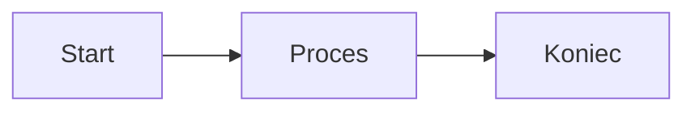

<p align="center">
  
</p>

<p align="center">
  <strong>Nowoczesny, otwartoźródłowy edytor Markdown z wbudowaną obsługą diagramów Mermaid</strong>
</p>

<p align="center">
  <a href="https://github.com/chinghssu/MerMarkEditorQ/releases"></a>
  <a href="https://github.com/chinghssu/MerMarkEditorQ/blob/master/LICENSE"></a>
  <a href="https://github.com/chinghssu/MerMarkEditorQ/stargazers"></a>
  <a href="https://github.com/chinghssu/MerMarkEditorQ/releases"></a>
  <a href="https://buymeacoffee.com/vesperinio"></a>
</p>

<p align="center">
  <a href="#asystent-ai-lokalnie">Asystent AI</a> •
  <a href="#funkcje">Funkcje</a> •
  <a href="#zrzuty-ekranu">Zrzuty ekranu</a> •
  <a href="#instalacja">Instalacja</a> •
  <a href="#użytkowanie">Użytkowanie</a> •
  <a href="#rozwój">Rozwój</a>
</p>

<p align="center">
  <a href="README.md">English</a> •
  <strong>Polski</strong> •
  <a href="README_ZH.md">中文</a>
</p>

---

## ⚠️ Czym ten fork różni się od oryginału

To jest osobisty, dostosowany fork projektu [Vesperino/MerMarkEditor](https://github.com/Vesperino/MerMarkEditor). Całe uznanie za oryginalny projekt należy do [Vesperino](https://github.com/Vesperino). Ten fork jest udostępniany na licencji MIT — zobacz [LICENSE](LICENSE).

Zmiany względem wersji oryginalnej:

- **Dodano obsługę równań matematycznych** — matematyka w treści i blokowa (`$...$`, `$$...$$`) renderowana przez KaTeX, czego oryginał nie obsługuje.
- **Zmieniono sposób eksportu PDF** — oryginalny eksport PDF oparty na drukowaniu nie renderował poprawnie równań, więc ten fork generuje pliki PDF bezpośrednio przez `wkhtmltopdf`, aby równania wyglądały prawidłowo. ⚠️ Oznacza to, że do eksportu PDF musi być zainstalowany [`wkhtmltopdf`](https://wkhtmltopdf.org/).
- **Naprawiono obramowania tabel w PDF** — pogrubiono linie siatki tabel, które wcześniej były zbyt cienkie, by były widoczne w PDF.

---

## Dlaczego MerMark Editor?

**MerMark Editor** łączy prostotę Markdown z mocą diagramów Mermaid w pięknej, natywnej aplikacji desktopowej. Idealny dla programistów, autorów dokumentacji technicznej i każdego, kto potrzebuje tworzyć dokumentację z diagramami przepływu, sekwencji i innymi wizualizacjami.

### Główne zalety

- **Bez zależności od chmury** - Twoje dokumenty zostają na Twoim komputerze
- **Natywna wydajność** - Zbudowany z Tauri dla szybkiego, lekkiego działania
- **Edycja WYSIWYG** - Zobacz sformatowaną treść podczas pisania
- **Integracja Mermaid** - Twórz diagramy bezpośrednio w dokumentach
- **Workspace'y wielu folderów** - Otwórz jeden lub kilka folderów; AI widzi je jako scoped read-only context
- **Lokalny asystent AI** - Rozmawiaj z Claude lub Codex o swoich notatkach; AI edytuje pliki bezpośrednio
- **Wieloplatformowy** - Dostępny na Windows, macOS i Linux

<p align="center">
  
  
</p>

---

## Asystent AI lokalnie

Jeśli już płacisz za **Claude Code** albo **OpenAI Codex** — albo oba — MerMark wpina ten abonament prosto do edytora. Panel AI rozmawia z CLI `claude` i `codex` które masz już zalogowane, więc każde zapytanie idzie przez konto za które już płacisz. Żadnego klucza API do generowania. Żadnego drugiego rachunku. Żadnego pośrednika między tobą a dostawcą.

<p align="center">
  
  <br>
  <em>Panel AI zadokowany przy edytorze — wybór modelu, lista wątków, przypięte fragmenty i pasek użycia kontekstu na żywo</em>
</p>

### Korzystaj z abonamentu który już masz

- **Claude Code lub Codex na planie Pro/Plus** — MerMark używa tego loginu, bez dodatkowego konta.
- **Brak tokenu API do zarządzania** — CLI obsługuje auth, MerMark nigdy nie widzi twoich kluczy.
- **Bezpośrednio do dostawcy** — zapytania idą z twojej maszyny prosto do Anthropic lub OpenAI; nic po drodze.
- **Brak telemetrii** — z edytora nie wycieka nic poza wywołaniem CLI które sam mógłbyś uruchomić w terminalu.
- **Zmiana dostawcy per turę** — jeden czat na Claude, następny na Codex; oba skonfigurowane w jednym panelu.

### Co potrafi

- **Edytuje twój markdown bezpośrednio** — "przepisz tę sekcję przyjaźniej", "wyciągnij action items", "przetłumacz na angielski". Zapisuje wprost na dysk atomicznie; edytor sam się przeładowuje.
- **Czyta z autoryzowanych folderów** — wskaż folder projektu w access map i AI zobaczy notatki z wczoraj, glosariusz, style guide.
- **Modyfikuje sąsiednie pliki** — rozdziela długi dokument, generuje podsumowanie obok źródła, buduje plik TOC dla folderu.
- **Przeszukuje sieć** — włącz przełącznik `network` gdy potrzebujesz świeżych informacji.
- **Uruchamia komendy shell** — opcjonalny przełącznik `bash` do grepowania notatek, uruchamiania builda, czegokolwiek z terminala. Domyślnie wyłączone.
- **Auto-snapshot przy każdym zapisie AI** — jeden klik **Cofnij** jeśli wynik nie jest tym co chciałeś.

### Wielokrotne zaznaczenia i załączniki obrazów

- Przypnij jeden lub więcej zaznaczonych fragmentów — Visual *i* Code view.
- AI dostaje tylko te fragmenty, nie cały dokument.
- Wyłącz **Send** żeby zachować piny widoczne bez wysyłania.
- Wklej zrzut (`Ctrl+V`), przeciągnij obraz, lub wybierz z dysku.
- 8 MB na obraz, png / jpg / gif / webp / bmp.
- Zarówno Claude jak i Codex widzą obraz.
- Wysłane obrazy zostają w historii czatu jako miniatury — pamiętasz co przekazałeś.

<p align="center">
  
  <br>
  <em>Przypnij wiele zaznaczonych fragmentów przed wysłaniem — każdy pojawia się jako numerowany chip w composerze</em>
</p>

### Wywołania narzędzi widoczne w czacie

- Każde narzędzie wywołane przez model pojawia się jako kreskowany chip w transkrypcie.
- Chip nosi nazwę narzędzia i jednolinijkowy podgląd argumentów.
- Klik rozwija pretty-printed JSON pełnego wywołania.
- Pokrywa Read, Edit, Write, Bash, WebFetch, codex shell — wszystko.

<p align="center">
  
  <br>
  <em>Każde narzędzie którego używa AI (Read, Edit, Write, Bash, WebFetch, ...) widoczne jako rozwijalny chip</em>
</p>

### Wątki per dokument z przywracaniem kontekstu

- Każdy dokument ma własną przewijalną historię wątków.
- **+** archiwizuje aktualny czat i zaczyna nowy.
- Do 50 wątków na dokument, zapisane w `localStorage`.
- Otwarcie starego wątku przywraca CLI, model i reasoning effort z których korzystałeś.

### Bezpieczeństwo, audyt, kontrola dostępu per dokument

- Per-dokument access map: wprost określone read paths, write paths, przełączniki narzędzi.
- Dodawaj pliki przez **+ File**, całe foldery przez **+ Folder**.
- Snapshoty przed edycją auto-rotowane (domyślnie 3 + przypięte), jeden klik **Cofnij**.
- Status bar dot: zielony / czerwony / mrugający czerwony (bypass on).
- Append-only audit log każdej akcji AI, podgląd w Settings.

<p align="center">
  
  <br>
  <em>Access map per dokument — wprost określone read / write paths i przełączniki narzędzi</em>
</p>

<p align="center">
  
  <br>
  <em>Historia snapshotów — przywróć, przypnij, eksportuj lub usuń wersje sprzed edycji</em>
</p>

### Dwóch dostawców, jeden panel

- Przełączaj `claude` / `codex` z headera czatu.
- Domyślne ustawienia per CLI utrzymują się (ostatni model, ostatni effort).
- Streaming tokenów z thinking-indicatorem dopóki pierwszy chunk nie dotrze.
- Segmentowy pasek użycia kontekstu — input, cache, free — pobierany z usage zwracanego przez CLI.
- Klikalne linki otwierają się przez dialog potwierdzania zewnętrznych linków edytora.
- Skrót wysyłania: `Ctrl+Enter` (Win/Linux), `Cmd+Enter` (macOS).
- Minimalizacja do bocznej zakładki, fullscreen, zamknięcie — wszystko w headerze panelu.

### Edycja diagramów Mermaid przez AI

- Klik **AI** na diagramie (lub w fullscreen edycji) — główny panel auto-pinuje kod diagramu jako scoped context i przełącza preamble w mermaid-edit mode.
- Ten sam panel, ten sam wybór modelu, ta sama wieloturowa rozmowa co dla prozy.
- Każda odpowiedź asystenta jest parsowana pod kątem `mermaid` fenced bloku i renderowana na żywo zamiast zapisanego diagramu.
- Przyciski **Apply ✓ / Discard × / Stop** w chipie panelu; Apply zapisuje do node, Discard kontynuuje rozmowę, Stop kończy sesję.

Pełna lista funkcji — łącznie z rotacją snapshotów, recovery tmp po zawieszonych sesjach, multi-window-safe streamingiem i izolacją sesji per CLI — żyje w [RELEASE_NOTES.md](RELEASE_NOTES.md).

---

## Funkcje

### Edycja Markdown
- Pełna obsługa **GitHub Flavored Markdown** (GFM)
- **Edytor WYSIWYG** z podglądem na żywo
- **Kolorowanie składni** dla bloków kodu (50+ języków)
- Tabele, listy zadań, cytaty i więcej
- **Skróty klawiszowe** dla efektywnej edycji
- **Konfigurowalny padding** — suwaki góry, boków i dołu w Settings

### Diagramy Mermaid
- **Flowchart**, **sequence**, **class**, **state**, **ER**, **Gantt**, **pie** i wiele innych typów
- **Skalowanie** w dokumencie — przeciągnij prawą krawędź żeby ustawić własną szerokość (zapisana w markdownie)
- **Skalowanie split** w fullscreen edycji — przeciągnij divider między panelami kodu i podglądu
- **AI assist** — klik AI na diagramie i główny panel AI przejmuje sterowanie z diagramem przypiętym jako kontekst
- **Szybkie szablony** — flowchart / sequence / class / state / ER / Gantt / pie / mindmap jednym klikiem

### Workspace'y
- **Pasek wielu folderów** — otwórz jeden lub kilka; każdy ma własną sekcję z drzewem plików
- **Drzewo plików** — rozwijanie folderów, otwieranie plików w zakładkach, OS-level reveal, rename, delete, nowy plik / folder
- **AI widzi workspace** — root workspace'u dodawany do AI preamble jako read-only scope automatycznie
- **Quick switcher** (`Ctrl+Shift+E`) — workspace'y, pliki, full-text grep w aktywnym workspace
- **Drag do reorder** workspace'ów; rozwinięte foldery utrzymują się między sesjami

### Eksport i integracja
- **Eksport do PDF** — bliski WYSIWYG: ten sam serif font i skala co edytor, kolorowane bloki kodu, koralowy inline code, tabele dopasowane do zawartości
- **Zapis jako Markdown** (pliki .md), czysty przenośny format
- Ustawienia paddingu edytora przekładają się na marginesy PDF

### Doświadczenie użytkownika
- **Zakładki z pin / context menu** — Pin / Unpin / Close / Close others / Close all but pinned / Close saved
- **Jasny/Ciemny motyw** plus wariant **Minimal** (paleta z logo Mermaid: teal + coral na slate)
- **Suwak zoom w stylu Word** w status barze — przyciski `±` + odczyt procentów
- **Licznik znaków / słów / linii / tokenów** jako pojedyncza przesuwalna jednostka
- **Stylizowane prompt / confirm dialogi** wszędzie (bez natywnych modali przeglądarki)
- **Automatyczny zapis** — nigdy nie stracisz pracy
- **Trójjęzyczny interfejs** - polski, angielski i chiński
- **Modal skrótów klawiszowych** - Szybki podgląd wszystkich skrótów (`Ctrl+/`)

### Zaawansowane funkcje
- **Widok podzielony** - Edycja dwóch dokumentów obok siebie z regulowaną proporcją
- **Porównywanie zakładek** - Porównanie diff między dokumentami w lewym i prawym panelu (`Ctrl+Shift+C`)
- **Śledzenie zmian** - Podgląd wszystkich zmian od ostatniego zapisu (`Ctrl+Shift+D`)
- **Widok kodu** - Przełączanie między edytorem wizualnym a kodem Markdown ze śledzeniem kursora
- **Licznik tokenów AI** - Szacowanie tokenów dla GPT (OpenAI), Claude (Anthropic) i Gemini (Google)
- **Obsługa wielu okien** - Otwieranie wielu niezależnych okien edytora
- **Zarządzanie kartami między oknami** - Przeciąganie kart między panelami i oknami
- **Obserwowanie plików** - Automatyczne wykrywanie zewnętrznych zmian i przeładowanie zawartości
- **Wykrywanie konfliktów** - Wyświetla porównanie diff gdy istnieją zarówno lokalne jak i zewnętrzne zmiany
- **Ręczne przeładowanie** - Przeładuj plik z dysku za pomocą `Ctrl+R`

---

## Zrzuty ekranu

<p align="center">

  <br>
  <em>Tryb ciemny</em>
</p>

<p align="center">

  <br>
  <em>Czysty, minimalistyczny interfejs z intuicyjnym paskiem narzędzi</em>
</p>

<p align="center">

  <br>
  <em>Edycja wielu dokumentów w zakładkach z klikalnym spisem treści</em>
</p>

<p align="center">

  <br>
  <em>Diagramy architektury C4 z kontrolą powiększenia i trybem pełnoekranowym</em>
</p>

<p align="center">

  <br>
  <em>Pełnoekranowy widok diagramu z 400% powiększeniem dla szczegółowej inspekcji</em>
</p>

<p align="center">

  <br>
  <em>Dokumentacja techniczna z blokami kodu i osadzonymi diagramami</em>
</p>

<p align="center">

  <br>
  <em>Widok podzielony do edycji dwóch dokumentów jednocześnie</em>
</p>

<p align="center">

  <br>
  <em>Porównywanie dokumentów z podświetleniem różnic na poziomie linii</em>
</p>

<p align="center">

  <br>
  <em>Podgląd wszystkich zmian od ostatniego zapisu z dodaniami i usunięciami</em>
</p>

<p align="center">

  <br>
  <em>Przełączanie między widokiem wizualnym a kodem Markdown ze śledzeniem kursora</em>
</p>

<p align="center">

  <br>
  <em>Szybki podgląd wszystkich skrótów klawiszowych (Ctrl+/)</em>
</p>

<p align="center">

  <br>
  <em>Licznik tokenów AI z wyborem modelu (GPT, Claude, Gemini)</em>
</p>

<p align="center">

  <br>
  <em>Wiele okien z przeciąganiem kart między oknami</em>
</p>

---

## Instalacja

### Pobieranie

Pobierz najnowszą wersję ze [strony wydań](https://github.com/chinghssu/MerMarkEditorQ/releases).

| Platforma | Pobierz |
|-----------|---------|
| Windows   | [.exe / .msi installer](https://github.com/chinghssu/MerMarkEditorQ/releases/latest) |
| macOS     | [.dmg (universal: Apple Silicon + Intel)](https://github.com/chinghssu/MerMarkEditorQ/releases/latest) |
| Linux     | [.deb / .AppImage](https://github.com/chinghssu/MerMarkEditorQ/releases/latest) |

### Automatyczne aktualizacje

Buildy wydaniowe zawierają metadane Tauri updatera. Paczki updatera dla macOS są podpisywane w CI prywatnym kluczem updatera, a odpowiadający mu klucz publiczny znajduje się w `src-tauri/tauri.conf.json`. Przechowuj `TAURI_SIGNING_PRIVATE_KEY` i `TAURI_SIGNING_PRIVATE_KEY_PASSWORD` tylko w GitHub Secrets albo lokalnych zmiennych środowiskowych. Pełny proces opisuje [docs/development/updater-signing.md](docs/development/updater-signing.md).

### Wymagania systemowe

- **Windows**: Windows 10 lub nowszy (64-bit)
- **macOS**: macOS 10.15 (Catalina) lub nowszy
- **Linux**: Ubuntu 22.04+ lub odpowiednik (wymagany WebKitGTK 4.1)

---

## Użytkowanie

### Podstawowa edycja

1. **Otwórz plik**: `Ctrl+O` (lub `Cmd+O` na macOS)
2. **Zapisz**: `Ctrl+S` (zapisuje jako Markdown)
3. **Zapisz jako**: `Ctrl+Shift+S`
4. **Eksportuj do PDF**: Kliknij przycisk PDF w pasku narzędzi

### Skróty klawiszowe

| Akcja | Skrót |
|-------|-------|
| Nowy plik | `Ctrl+N` |
| Otwórz plik | `Ctrl+O` |
| Zapisz | `Ctrl+S` |
| Zapisz jako | `Ctrl+Shift+S` |
| Eksport PDF | `Ctrl+P` |
| Cofnij | `Ctrl+Z` |
| Ponów | `Ctrl+Y` |
| Pogrubienie | `Ctrl+B` |
| Kursywa | `Ctrl+I` |
| Pokaż zmiany | `Ctrl+Shift+D` |
| Porównaj zakładki | `Ctrl+Shift+C` |
| Przeładuj plik | `Ctrl+R` |
| Zamknij kartę | `Ctrl+W` |
| Następna karta | `Ctrl+Tab` |
| Poprzednia karta | `Ctrl+Shift+Tab` |
| Przejdź do karty 1–9 | `Ctrl+1` … `Ctrl+9` |
| Przełącz widok Kod / Wizualny | `Ctrl+Shift+V` |
| Powiększ / pomniejsz | `Ctrl++` / `Ctrl+-` |
| Reset powiększenia | `Ctrl+0` |
| Ustawienia | `Ctrl+,` |
| Skróty klawiszowe | `Ctrl+/` |
| Zamknij modal | `Escape` |

> Na macOS używaj `⌘` (Cmd) zamiast `Ctrl`.

### Tworzenie diagramów Mermaid

Kliknij przycisk **Mermaid** w pasku narzędzi lub wpisz:

~~~markdown

~~~

To tworzy diagram przepływu:

```
[Start] --> [Proces] --> [Koniec]
```

### Obsługiwane typy diagramów

- `graph` / `flowchart` - Diagramy przepływu
- `sequenceDiagram` - Diagramy sekwencji
- `classDiagram` - Diagramy klas
- `stateDiagram-v2` - Diagramy stanów
- `erDiagram` - Diagramy relacji encji
- `gantt` - Wykresy Gantta
- `pie` - Wykresy kołowe
- `journey` - Diagramy ścieżki użytkownika
- `gitgraph` - Grafy Git
- `mindmap` - Mapy myśli
- `timeline` - Osie czasu

---

## Rozwój

### Wymagania wstępne

- [Node.js](https://nodejs.org/) 18+
- [Rust](https://rustup.rs/) (dla Tauri)
- [pnpm](https://pnpm.io/) (zalecane)

### Konfiguracja

```bash
# Sklonuj repozytorium
git clone https://github.com/chinghssu/MerMarkEditorQ.git
cd MerMarkEditorQ

# Zainstaluj zależności
pnpm install

# Uruchom w trybie deweloperskim
pnpm tauri dev

# Zbuduj wersję produkcyjną
pnpm tauri build
```

### Podpis updatera

Przy buildach wydaniowych generujących artefakty updatera wyeksportuj prywatny klucz i hasło przed budowaniem:

```bash
export TAURI_SIGNING_PRIVATE_KEY="zawartosc prywatnego klucza"
export TAURI_SIGNING_PRIVATE_KEY_PASSWORD="haslo klucza"
pnpm tauri build
```

Nie commituj prywatnego klucza, hasła, plików `.env` ani wygenerowanych plików secret key. CI oczekuje tych wartości w sekretach repozytorium `TAURI_SIGNING_PRIVATE_KEY` i `TAURI_SIGNING_PRIVATE_KEY_PASSWORD`.

### Uruchamianie testów

```bash
# Uruchom testy
pnpm test

# Uruchom testy jednokrotnie
pnpm test:run
```

### Stos technologiczny

- **Frontend**: Vue 3 + TypeScript
- **Edytor**: TipTap (oparty na ProseMirror)
- **Diagramy**: Mermaid.js
- **Desktop**: Tauri 2.0
- **Build**: Vite

---

## Współtworzenie

Wkład jest mile widziany! Zachęcamy do tworzenia Pull Requestów.

1. Zforkuj repozytorium
2. Utwórz gałąź funkcji (`git checkout -b feature/NowaFunkcja`)
3. Zatwierdź zmiany (`git commit -m 'Dodaj NowaFunkcja'`)
4. Wypchnij gałąź (`git push origin feature/NowaFunkcja`)
5. Otwórz Pull Request

---

## Licencja

Ten projekt jest licencjonowany na warunkach **licencji MIT** - zobacz plik [LICENSE](LICENSE) po szczegóły.

---

## Podziękowania

- [Codycody31](https://github.com/Codycody31) - Wielkie podziękowania za wsparcie macOS i Linux!
- [TipTap](https://tiptap.dev/) - Framework edytora headless
- [Mermaid](https://mermaid.js.org/) - Narzędzie do tworzenia diagramów
- [Tauri](https://tauri.app/) - Framework aplikacji desktopowych
- [Vue.js](https://vuejs.org/) - Progresywny framework JavaScript

---

## Wsparcie

MerMark jest i pozostanie darmowy oraz open source na licencji MIT. Jeśli uważasz ten projekt za użyteczny, rozważ:

- Danie gwiazdki na GitHub
- Zgłaszanie błędów i sugestii funkcji
- Wkład w kod źródłowy
- [Postawienie mi kawy](https://buymeacoffee.com/vesperinio) — całkowicie opcjonalnie, jeżeli MerMark oszczędza ci czas

<p align="center">
  <a href="https://buymeacoffee.com/vesperinio">
    
  </a>
</p>

---

<p align="center">
  Stworzone z ❤️ przez <a href="https://github.com/Vesperino">Vesperino</a>
</p>
